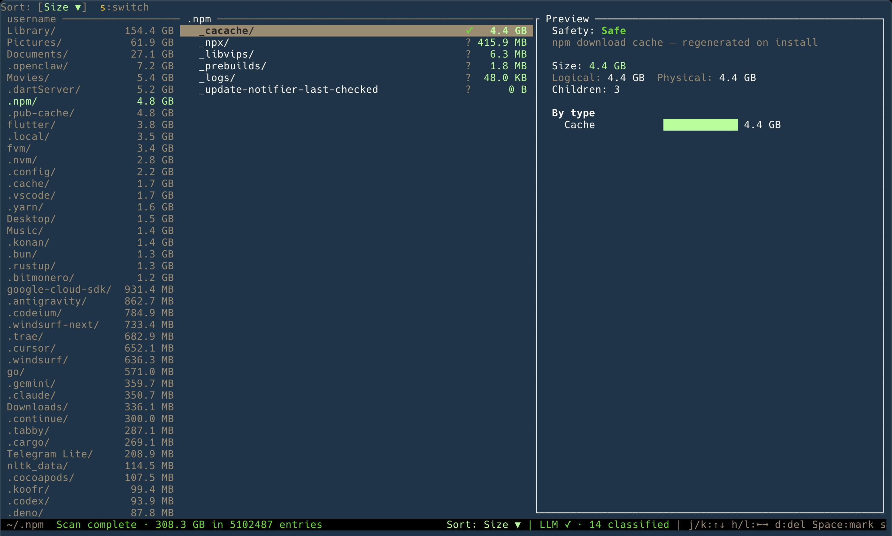

# Purifier

Purifier is a macOS terminal disk cleanup tool that helps you answer three questions before deleting anything:

- What is taking up space?
- Is it probably safe to remove?
- How much space will I actually get back?

It combines fast filesystem scanning, macOS-specific safety rules, optional LLM classification for unknown paths, and an interactive TUI built around Miller Columns.



## Why use it

Tools like `du`, `ncdu`, and Finder can show size, but they usually stop there. Purifier is meant for the moment when you have found a 4 GB folder and still do not know whether deleting it is harmless, risky, or a guaranteed mistake.

Purifier helps by:

- finding the biggest directories and files quickly
- classifying common macOS paths as `Safe`, `Caution`, `Unsafe`, or `Unknown`
- showing a one-line reason for that classification
- using physical disk usage by default, so cache and hard-link heavy paths are less misleading
- letting you review and delete one item or a marked batch from inside the TUI

## What it does

1. Scan a directory and measure logical and physical disk usage.
2. Apply built-in safety rules to common macOS paths such as caches, build artifacts, downloads, app data, and system locations.
3. Optionally send unmatched paths to an LLM for a best-effort safety classification.
4. Show the results in a three-pane terminal UI where you can navigate, inspect, and delete with confirmation.

## TUI overview

Purifier uses **Miller Columns**:

- **Left pane**: parent directory
- **Center pane**: current directory, sorted by the active sort key
- **Right pane**: preview for the selected item

The preview pane is where Purifier explains why something looks safe or risky. It also hosts:

- file and directory details
- type and age breakdowns
- settings
- quick delete confirmation
- batch delete review
- help overlay

Navigation enters directories with `l` / `Enter` and goes back with `h`. This is not a tree with expand/collapse rows.

## Installation

```bash
git clone https://github.com/RockinPaul/purifier.git
cd purifier
cargo build --release
```

Binary path:

```bash
target/release/purifier
```

## Quick start

Launch without a path to open onboarding on first launch and then the directory picker:

```bash
purifier
```

Scan a specific directory:

```bash
purifier ~/Downloads
```

Disable LLM classification and use rules only:

```bash
purifier --no-llm ~/Projects
```

Use OpenAI for unknown-path classification:

```bash
purifier --provider openai --api-key YOUR_KEY ~/Library
```

## Usage

### Common workflows

Find space quickly:

```bash
purifier ~/Library
```

Audit developer caches and build output:

```bash
purifier ~/Projects
```

Run with rules only when you do not want any remote classification:

```bash
purifier --no-llm ~/Downloads
```

### Environment variables

| Variable | Description |
|----------|-------------|
| `OPENROUTER_API_KEY` | API key for OpenRouter classification |
| `OPENAI_API_KEY` | API key for OpenAI classification |

### Credential storage

If you save an API key from the settings UI, Purifier stores it in plaintext in the app config directory as `secrets.toml`. On macOS that is typically:

```text
~/Library/Application Support/purifier/secrets.toml
```

The file is written with restrictive permissions on Unix, but it is not keychain-backed or encrypted at rest.

This is the current reliability-first storage path. A safer long-term replacement is tracked in [docs/ISSUES.md](docs/ISSUES.md).

If you do not want on-disk persistence, use `--api-key` for a single run or provide `OPENROUTER_API_KEY` / `OPENAI_API_KEY` in the environment.

### CLI options

| Option | Description |
|--------|-------------|
| `[PATH]` | Directory to scan. If omitted, Purifier opens the directory picker. |
| `--rules <FILE>` | Additional TOML rules file, evaluated before defaults |
| `--no-llm` | Disable LLM classification entirely |
| `--api-key <KEY>` | API key for the selected remote provider |
| `--provider <PROVIDER>` | LLM provider. Runtime-wired options are `openrouter` and `openai` |

## How to use the TUI

### Navigation

| Key | Action |
|-----|--------|
| `j` / `k` or `Down` / `Up` | Move within the current column |
| `l` / `Right` / `Enter` | Enter the selected directory |
| `h` / `Left` | Go back to the parent directory |
| `g` / `G` | Jump to top / bottom of the current column |
| `~` | Jump to the home directory when it is inside the scan root |
| `s` | Cycle sort: Size -> Safety -> Age -> Name |
| `i` | Toggle size mode: Physical <-> Logical |

### Deletion

| Key | Action |
|-----|--------|
| `d` | Open quick delete confirmation in the preview pane |
| `Space` | Mark or unmark the selected item for batch deletion |
| `x` | Review all marked items in batch review |
| `u` | Clear all marks |
| `y` / `n` | Confirm or cancel deletion in delete and batch review modes |

### Other

| Key | Action |
|-----|--------|
| `,` | Open settings in the preview pane |
| `?` | Open help in the preview pane |
| `q` / `Esc` | Quit, or cancel the active modal |

Inside settings:

- `1`-`4` selects the provider slot
- `a` edits the API key
- `m` toggles size mode
- `p` cycles the scan profile
- `Enter` saves
- `Esc` cancels

## Safety classification

### Built-in rules

Purifier ships with macOS-specific rules in `rules/default.toml` for common cleanup targets, including:

| Category | Examples | Default safety |
|----------|----------|----------------|
| **Build Artifacts** | `node_modules/`, `target/`, `DerivedData/`, `Pods/`, `__pycache__/` | Safe |
| **Caches** | `~/Library/Caches/*`, `~/.cache/*`, `~/.npm/_cacache`, `~/.Trash/*` | Safe |
| **Downloads** | `~/Downloads/*.dmg`, `~/Downloads/*.pkg`, `~/Downloads/*.zip` | Caution |
| **App Data** | `~/Library/Application Support/*`, `~/Library/Preferences/*` | Unsafe |
| **System** | `.git/objects`, `/System/**`, `~/Library/Keychains/*` | Unsafe |

Rules are evaluated top-to-bottom, first match wins.

### Optional LLM fallback

If a path does not match any built-in rule, Purifier can batch it for optional LLM classification.

Current provider truth:

- runtime-wired now: `OpenRouter`, `OpenAI`
- persisted in settings but not runtime-wired yet: `Anthropic`, `Google`
- intentionally disabled: `Ollama`

Privacy note:

- remote classification can send the exact path string
- it also sends whether the entry is a file or directory, plus byte size and age metadata
- this can expose personal, employer, or project names embedded in local paths
- use `--no-llm` if you do not want any path metadata sent to a provider

If LLM classification is disabled, unavailable, or not configured, unmatched paths remain `Unknown` and the tool stays fully usable.

## Size semantics

Purifier tracks two size measurements:

- **Physical**: allocated bytes on disk, based on filesystem block allocation
- **Logical**: file content length, closer to what Finder usually shows

Physical size is the default mode in the TUI.

Important notes:

- physical totals are hard-link-aware
- delete feedback prefers observed free-space deltas when available
- APFS clone and shared-block accounting is still best-effort, not exact unique ownership

## Scan behavior

Current scan behavior is intentionally simple and truthful:

- scans are blocking
- the progress overlay stays visible until the scan completes
- the columns populate after the scan completes
- `q` and `Esc` remain responsive during scanning
- LLM batching can overlap with the hidden scan phase

## Scan profiles

Purifier includes built-in scan profiles:

- `Full scan`
- `Fast developer scan`

The current UI focuses on selecting a persisted profile in settings. Profiles affect scan-time exclusion.

## Custom rules

Create your own TOML rules file:

```toml
[[rules]]
pattern = "**/my-project/dist"
category = "BuildArtifact"
safety = "Safe"
reason = "Build output - regenerated by `npm run build`"

[[rules]]
pattern = "~/Movies/*.mov"
category = "Media"
safety = "Caution"
reason = "Video file - review before deleting"
```

Run with it:

```bash
purifier --rules my-rules.toml ~/Projects
```

Custom rules are evaluated before the defaults.

## Architecture

```text
purifier/
├── crates/
│   ├── purifier-core/       # scanner, filters, size model, classifier, provider clients
│   └── purifier-tui/        # Ratatui app, input handling, settings, rendering
└── rules/
    └── default.toml         # built-in macOS safety rules
```

Two-crate workspace:

- **`purifier-core`**: filesystem logic, classification, batching, and size accounting
- **`purifier-tui`**: Miller Columns UI, config, onboarding, settings, and delete flows

## Development

```bash
cargo build
cargo test
cargo run -- ~/tmp
cargo clippy --all-targets --all-features --locked -- -D warnings
```

## Platform support

Purifier is macOS-first today. The built-in safety rules target macOS paths and conventions.

## Similar tools

| Tool | Language | Difference |
|------|----------|------------|
| [dua-cli](https://github.com/Byron/dua-cli) | Rust | No safety classification or explanations |
| [mcdu](https://github.com/mikalv/mcdu) | Rust | Developer-focused, no LLM, no general-user mode |
| [dust](https://github.com/bootandy/dust) | Rust | Non-interactive, no deletion workflow |
| [ncdu](https://code.blicky.net/yorhel/ncdu) | C | No safety classification |
| [GrandPerspective](https://grandperspectiv.sourceforge.io/) | Obj-C | GUI only, no safety classification |

## License

This project is licensed under the MIT License. See [LICENSE](LICENSE).
